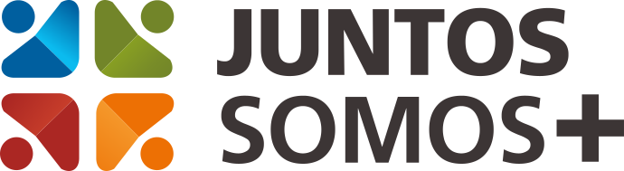
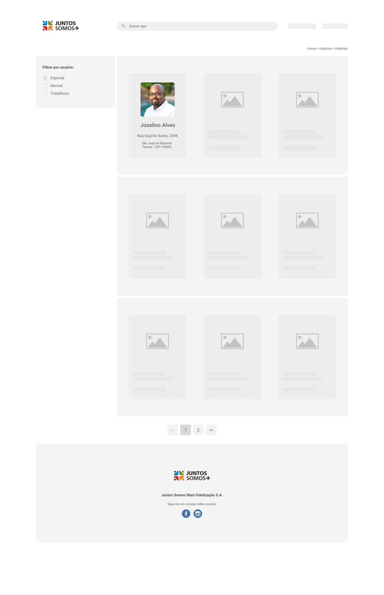

  

# <frontend-developer />

The main objective of this challenge is to test your skills in Front-end Development 🥳

- Your coding style;
- Knowledges on frameworks and other technologies;
- Good practices;
- Tests;
- Your skills with UI/UX.

## Rules

- Your code should be made available in a public or private repository on your personal Github;
- You can feel free to choose your favorite architectures, frameworks, libs and technologies;
- Send link to xx.

## The Challenge

The [following layout](layout.jpg) need to be developed.

Important to say that it is just a prototype, the idea is check your ability to propose improvements, features and contribute to the product UI 😄. Feel free to make improvements like new functionalities, animations, visual optimizations, etc.

You should to develop:

- Filters by region and / or customer classification;
- Search by name and / or last name;
- Navigation when click on customer cards;
- A internal page with more details of customers (use your creativity);
- We'll be happy if you develop tests for it.

The API that you need to develop this application is available at: 

- https://storage.googleapis.com/juntossomosmais-code-challenge/input-frontend-apps.json

## Questions

If you have some questions or suggestions, send your questions directly to xx or opening a issue.
