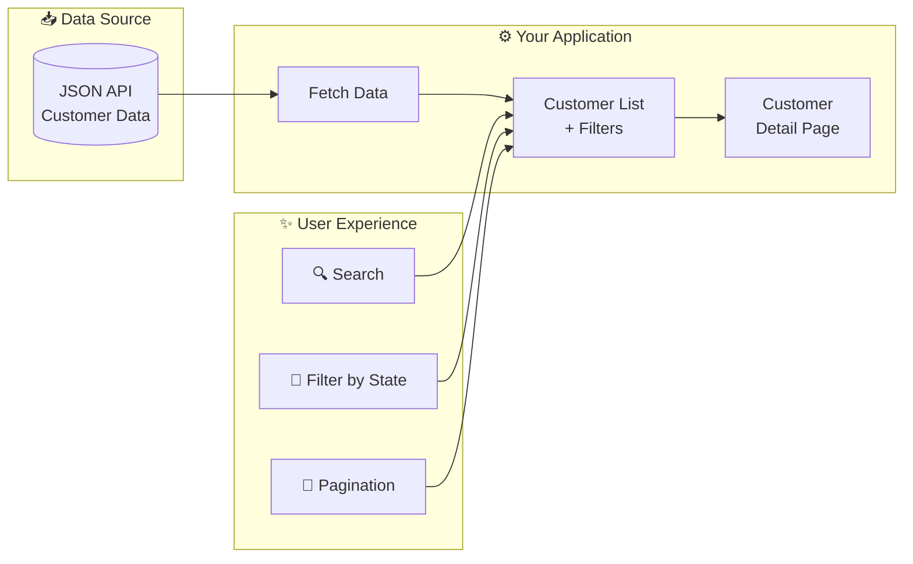
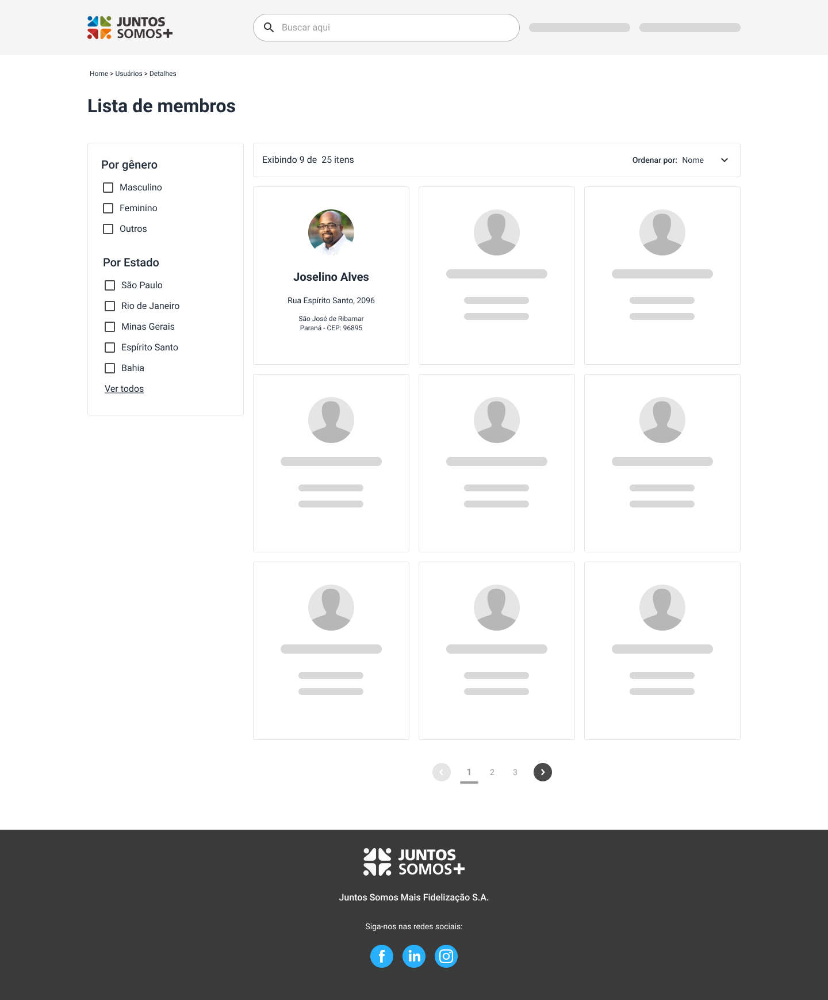
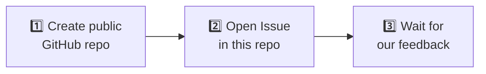

<p align="center">
  
</p>

<h1 align="center">&lt;frontend-challenge /&gt;</h1>

<p align="center">
  <strong>Build a Customer Directory • Show Your UI/UX Skills • Document Your AI Journey</strong>
</p>

<p align="center">
  <a href="./README.pt-BR.md">🇧🇷 Leia em Português</a>
</p>

<p align="center">
  
  
  
  
</p>

---

## 🎯 What We're Looking For

The main objective of this challenge is to assess your **Front-end Development skills**, your approach to **UI/UX**, and how you leverage **AI tools** in your workflow.

<table>
<tr>
<td>✅</td><td>Your coding style and component architecture</td>
</tr>
<tr>
<td>✅</td><td>Knowledge of frameworks and modern technologies</td>
</tr>
<tr>
<td>✅</td><td>UI/UX skills and attention to detail</td>
</tr>
<tr>
<td>✅</td><td>Testing strategies</td>
</tr>
<tr>
<td>✅</td><td>How you collaborate with AI tools</td>
</tr>
</table>

> [!IMPORTANT]
> 🤖 **AI collaboration is mandatory.** We don't want to know *if* you used AI. We want to know *how* you used it. Document your journey!

💡 Check out our [frontend-guideline](https://github.com/juntossomosmais/frontend-guideline) for some of our patterns and best practices.

---

## 📑 Table of Contents

- [🚀 The Challenge](#-the-challenge)
- [📐 Layout](#-layout)
- [🔌 API](#-api)
- [⭐ Evaluation Criteria](#-evaluation-criteria)
- [🤖 AI Journey (Required)](#-ai-journey-required)
- [📤 Submission](#-submission)
- [❓ FAQ](#-faq)

---

## 🚀 The Challenge

Build a **Customer Directory** application that allows users to browse, search, and view customer details.


```mermaid
flowchart LR
    subgraph INPUT["📥 Data Source"]
        API[("JSON API\nCustomer Data")]
    end

    subgraph APP["⚙️ Your Application"]
        FETCH["Fetch Data"]
        LIST["Customer List\n+ Filters"]
        DETAIL["Customer\nDetail Page"]
    end

    subgraph UX["✨ User Experience"]
        SEARCH["🔍 Search"]
        FILTER["📍 Filter by State"]
        PAGINATE["📄 Pagination"]
    end

    API --> FETCH
    FETCH --> LIST
    LIST --> DETAIL
    SEARCH --> LIST
    FILTER --> LIST
    PAGINATE --> LIST
```

### 📋 Requirements

You **must** implement:

| Feature | Description |
|---------|-------------|
| 🔍 **Search** | Search customers by name and/or last name |
| 📍 **Filter by State** | Filter the customer list by Brazilian states |
| 📄 **Pagination** | Navigate between pages of customer cards |
| 👤 **Customer Cards** | Display customer information in card format |
| 📑 **Detail Page** | Internal page with more customer details (use your creativity!) |
| 🧪 **Tests** | We'll be happy if you write tests for it |

---

## 📐 Layout

<p align="center">
  
</p>

> [!NOTE]
> This is just a **prototype**! We want to see your ability to propose improvements and new contributions to the UI.

### 🎨 Be Creative!

**Feel completely free** to add:

- ✨ Animations and micro-interactions
- 🎯 New filters and sorting options
- 📱 Responsive design improvements
- ♿ Accessibility features
- 🌙 Dark mode
- 🔔 Any feature you think adds value

---

## 🔌 API

### Endpoint

```
https://jsm-challenges.s3.amazonaws.com/frontend-challenge.json
```

### Sample Response

<details>
<summary>📄 <b>Click to see JSON structure</b></summary>

```json
{
  "results": [
    {
      "gender": "female",
      "name": {
        "title": "mrs",
        "first": "ione",
        "last": "da costa"
      },
      "location": {
        "street": "8614 rua santa catarina",
        "city": "ponta grossa",
        "state": "distrito federal",
        "postcode": 24358,
        "coordinates": {
          "latitude": "-73.6753",
          "longitude": "142.4098"
        },
        "timezone": {
          "offset": "-3:00",
          "description": "Brazil, Buenos Aires, Georgetown"
        }
      },
      "email": "ione.dacosta@example.com",
      "dob": {
        "date": "1968-01-24T18:03:23Z",
        "age": 50
      },
      "phone": "(01) 5765-3027",
      "cell": "(75) 9398-8111",
      "picture": {
        "large": "https://randomuser.me/api/portraits/women/50.jpg",
        "medium": "https://randomuser.me/api/portraits/med/women/50.jpg",
        "thumbnail": "https://randomuser.me/api/portraits/thumb/women/50.jpg"
      }
    }
  ]
}
```

</details>

> [!TIP]
> Feel free to use a **BFF (Backend for Frontend)** layer if you think it makes sense for your architecture.

---

## ⭐ Evaluation Criteria

We assess your submission across **7 competencies**. There are no "levels" to choose — just deliver your best work, and we'll evaluate where you stand.

<table>
<tr>
<td width="50%">

### 🎯 Problem Solving
- Correct implementation of all requirements
- Edge cases handling (empty states, errors, loading)
- Logical and efficient approach

### 🏗️ Code Architecture
- Clear component structure and separation
- State management strategy
- Reusable and maintainable code
- Consistent project organization

### ✨ Code Quality
- Readability over cleverness
- Meaningful naming conventions
- Consistent style (linting, formatting)
- Proper TypeScript usage (if applicable)

### 🧪 Testing
- Unit tests for components/utilities
- Integration tests for user flows
- Tests that catch real bugs
- Good testing practices

</td>
<td width="50%">

### 🎨 UI/UX
- Visual design and attention to detail
- Responsive design across devices
- Accessibility (a11y) considerations
- Smooth interactions and feedback
- Creative improvements to the prototype

### 🚀 Performance & Best Practices
- Bundle size awareness
- Core Web Vitals optimization
- SEO basics (semantic HTML, meta tags)
- Modern frontend practices

### 🤖 AI Collaboration
- Transparency in AI usage
- Critical thinking about AI-generated code
- Iteration and refinement over copy-paste
- Understanding of what the AI produced

</td>
</tr>
</table>

---

## 🤖 AI Journey (Required)

> [!CAUTION]
> This section is **mandatory**. Submissions without AI documentation will not be evaluated.

Create an `/ai-journey` folder in your repository documenting how you collaborated with AI tools.

### 📁 Required Structure

```
📁 ai-journey/
├── 📄 README.md          # Summary of your AI usage
├── 📄 prompts.md         # Key prompts you used
└── 📄 learnings.md       # What you learned in the process
```

### 📝 What to Document

#### `prompts.md` — The interesting parts, not everything

```markdown
## 🔧 Prompt: Component architecture
**Tool:** ChatGPT-4 / Claude / Copilot

**What I asked:**
"How should I structure my React components for a customer directory app?"

**What happened:**
Initial suggestion was over-engineered. I simplified to...

**Final approach:**
[your architecture]
```

#### `learnings.md` — Reflect on the experience

```markdown
## ✅ What worked well
- AI helped with CSS animations I wasn't familiar with
- Great for generating test boilerplate

## ❌ What didn't work
- Accessibility suggestions were incomplete
- Had to research WCAG guidelines myself

## 🔄 What I'd do differently
- Be more specific about design system constraints
- Ask for simpler solutions first
```

---

## 📤 Submission

### 💻 Tech Stack

<p>


</p>

Choose your favorite framework/library. We're framework-agnostic!

### 📁 Repository Structure

```
📁 your-repo/
├── 📂 src/                  # Source code (tests alongside components)
├── 📂 ai-journey/           # AI documentation (required!)
│   ├── 📄 README.md
│   ├── 📄 prompts.md
│   └── 📄 learnings.md
└── 📄 README.md             # Setup instructions
```

### 📮 How to Submit


```mermaid
flowchart LR
    A["1️⃣ Create public\nGitHub repo"] --> B["2️⃣ Open Issue\nin this repo"]
    B --> C["3️⃣ Wait for\nour feedback"]
```

**Issue format:**
- **Title:** `[Frontend] Your Name`
- **Content:** Link to your repository + brief description

### ⏰ Timeline

| Recommended | Need more time? |
|:-----------:|:---------------:|
| 10 days | Just let us know in the issue! |

---

## ❓ FAQ

<details>
<summary><b>🛠️ What frameworks can I use?</b></summary>

Any modern framework: React, Vue, Angular, Svelte, Next.js, Nuxt, etc. Choose what you're most comfortable with.
</details>

<details>
<summary><b>💼 Are there open positions?</b></summary>

Not always, but we maintain a talent pool. Great submissions stay on our radar for future opportunities.
</details>

<details>
<summary><b>⚠️ What if I can only complete part of the challenge?</b></summary>

Submit what you have! Partial submissions with quality code tell us more than complete submissions with poor code. Just document what's missing and why.
</details>

<details>
<summary><b>🎨 Should I follow the layout exactly?</b></summary>

No! The layout is just a starting point. We **want** to see your creativity and UI/UX improvements. Feel free to redesign it entirely if you have good ideas.
</details>

<details>
<summary><b>📊 How will I know my seniority level?</b></summary>

We don't ask you to self-declare a level. We evaluate your submission across all criteria and determine fit based on our internal standards.
</details>

<details>
<summary><b>🔧 Can I use component libraries (Material UI, Chakra, etc.)?</b></summary>

Yes, but we also want to see your CSS skills. A mix of custom styling and library components is perfectly fine.
</details>

---

## 🔗 Other Challenges

| Position | Repository |
|----------|------------|
| ⚙️ Backend | [backend-challenge](https://github.com/juntossomosmais/backend-challenge) |

---

## 💬 Questions?

<p>
  <a href="../../issues">📋 Open an Issue</a>
  &nbsp;•&nbsp;
  <a href="mailto:vagas-dev@juntossomosmais.com.br">✉️ vagas-dev@juntossomosmais.com.br</a>
</p>

> Before asking, check if your question was already answered in [previous issues](../../issues?q=is%3Aissue).

---

<p align="center">
  <sub>Made with 💛 by the Engineering Team at <a href="https://juntossomosmais.com.br">Juntos Somos Mais</a></sub>
</p>
