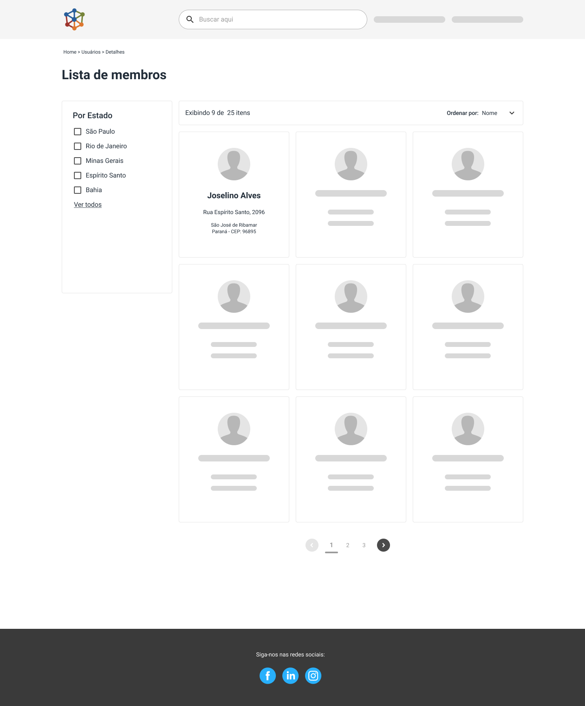

  

# <frontend-developer />

The main objective of this challenge is to test your skills in Front-end Development 🥳

- Your coding style;
- Knowledge on frameworks and other technologies;
- Good practices;
- Tests;
- Your skills about UI/UX.

## Rules

- Your code should be made available in a **private** repository on your personal Github;
- You can feel free to choose your favorite architectures, frameworks, libs and technologies;
- Ideally, you can deliver the challenge within 10 days. But if you need more time, let us know 😊

## The Challenge

The [following Figma layout needs to be developed](https://www.figma.com/file/ED8oK1CyH2BD5BjSAcy9vF/Teste-Front-end?node-id=505%3A2613).

It's important to say that it is just a prototype, the idea is to check your ability to propose improvements, features and contribute to the product UI 😄. Feel free to make improvements like new functionalities, animations, visual optimizations, etc.

The logo is the same as the one on the repository.

You **should** develop:

- Filter by state;
- Search by name and/or last name;
- Pagination to navigate between cards;
- Navigation when clicking on customer cards;
- An **internal page** with more details of customers (use your creativity);
- We'll be happy (😍) **if you develop tests** for it.

### API

The JSON that you need to develop for this application is available at:

- `https://jsm-challenges.s3.amazonaws.com/frontend-challenge.json`

You can feel free to use BFF (Back-end for Front-end) before using it on client-side, if you think that if it makes sense 👀

## Sending the test

After finishing the test, send an email to vagas-dev@juntossomosmais.com.br, with:

- Title: **[Front-end Developer] Your name**;
- Repository link with your test;
- Request from users who need access to run the challenge;
- Information about you: Github, LinkedIn and everything you consider important;

## Questions

If you have any questions or suggestions, send your questions directly to us (vagas-dev@juntossomosmais.com.br) or open an issue.

Please, check if your question has already been answered in [an issue](https://github.com/juntossomosmais/frontend-challenge/issues?q=) 😌
