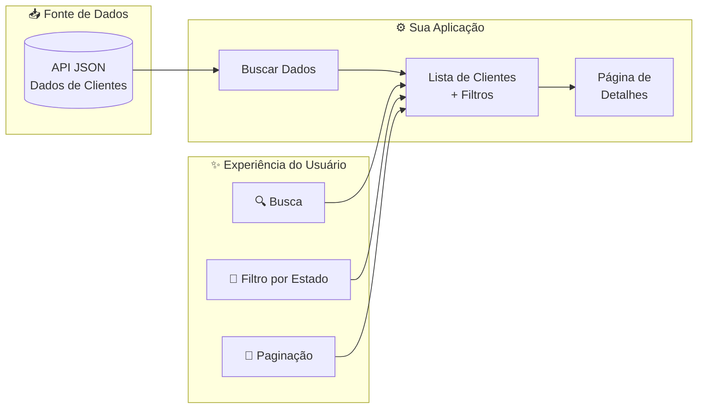
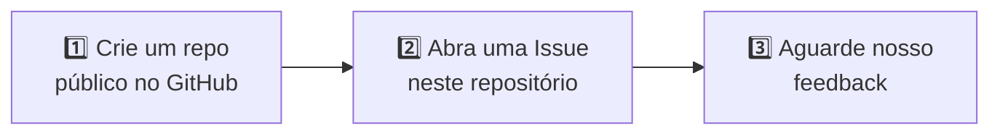

<p align="center">
  
</p>

<h1 align="center">&lt;frontend-challenge /&gt;</h1>

<p align="center">
  <strong>Construa um Diretório de Clientes • Mostre suas Habilidades de UI/UX • Documente sua Jornada com IA</strong>
</p>

<p align="center">
  <a href="./README.md">🇺🇸 Read in English</a>
</p>

<p align="center">
  
  
  
  
</p>

---

## 🎯 O Que Buscamos

O principal objetivo deste desafio é avaliar suas **habilidades em Desenvolvimento Front-end**, sua abordagem de **UI/UX**, e como você utiliza **ferramentas de IA** no seu fluxo de trabalho.

<table>
<tr>
<td>✅</td><td>Seu estilo de código e arquitetura de componentes</td>
</tr>
<tr>
<td>✅</td><td>Conhecimento de frameworks e tecnologias modernas</td>
</tr>
<tr>
<td>✅</td><td>Habilidades de UI/UX e atenção aos detalhes</td>
</tr>
<tr>
<td>✅</td><td>Estratégias de teste</td>
</tr>
<tr>
<td>✅</td><td>Como você colabora com ferramentas de IA</td>
</tr>
</table>

> [!IMPORTANT]
> 🤖 **Colaboração com IA é obrigatória.** Não queremos saber *se* você usou IA. Queremos saber *como* você usou. Documente sua jornada!

💡 Confira nosso [frontend-guideline](https://github.com/juntossomosmais/frontend-guideline) para conhecer alguns de nossos padrões e boas práticas.

---

## 📑 Índice

- [🚀 O Desafio](#-o-desafio)
- [📐 Layout](#-layout)
- [🔌 API](#-api)
- [⭐ Critérios de Avaliação](#-critérios-de-avaliação)
- [🤖 Jornada IA (Obrigatório)](#-jornada-ia-obrigatório)
- [📤 Entrega](#-entrega)
- [❓ FAQ](#-faq)

---

## 🚀 O Desafio

Construa uma aplicação de **Diretório de Clientes** que permita aos usuários navegar, buscar e visualizar detalhes de clientes.



### 📋 Requisitos

Você **deve** implementar:

| Funcionalidade | Descrição |
|----------------|-----------|
| 🔍 **Busca** | Buscar clientes por nome e/ou sobrenome |
| 📍 **Filtro por Estado** | Filtrar a lista de clientes por estados brasileiros |
| 📄 **Paginação** | Navegar entre páginas de cards de clientes |
| 👤 **Cards de Clientes** | Exibir informações dos clientes em formato de card |
| 📑 **Página de Detalhes** | Página interna com mais detalhes do cliente (use sua criatividade!) |
| 🧪 **Testes** | Ficaremos felizes se você escrever testes |

---

## 📐 Layout

<p align="center">
  
</p>

> [!NOTE]
> Este é apenas um **protótipo**! Queremos ver sua capacidade de propor melhorias e novas contribuições para a UI.

### 🎨 Seja Criativo!

**Sinta-se completamente livre** para adicionar:

- ✨ Animações e micro-interações
- 🎯 Novos filtros e opções de ordenação
- 📱 Melhorias no design responsivo
- ♿ Recursos de acessibilidade
- 🌙 Modo escuro
- 🔔 Qualquer funcionalidade que você ache que agregue valor

---

## 🔌 API

### Endpoint

```
https://jsm-challenges.s3.amazonaws.com/frontend-challenge.json
```

### Exemplo de Resposta

<details>
<summary>📄 <b>Clique para ver a estrutura JSON</b></summary>

```json
{
  "results": [
    {
      "gender": "female",
      "name": {
        "title": "mrs",
        "first": "ione",
        "last": "da costa"
      },
      "location": {
        "street": "8614 rua santa catarina",
        "city": "ponta grossa",
        "state": "distrito federal",
        "postcode": 24358,
        "coordinates": {
          "latitude": "-73.6753",
          "longitude": "142.4098"
        },
        "timezone": {
          "offset": "-3:00",
          "description": "Brazil, Buenos Aires, Georgetown"
        }
      },
      "email": "ione.dacosta@example.com",
      "dob": {
        "date": "1968-01-24T18:03:23Z",
        "age": 50
      },
      "phone": "(01) 5765-3027",
      "cell": "(75) 9398-8111",
      "picture": {
        "large": "https://randomuser.me/api/portraits/women/50.jpg",
        "medium": "https://randomuser.me/api/portraits/med/women/50.jpg",
        "thumbnail": "https://randomuser.me/api/portraits/thumb/women/50.jpg"
      }
    }
  ]
}
```

</details>

> [!TIP]
> Sinta-se livre para usar uma camada de **BFF (Backend for Frontend)** se achar que faz sentido para sua arquitetura.

---

## ⭐ Critérios de Avaliação

Avaliamos sua entrega em **7 competências**. Não há "níveis" para escolher — apenas entregue o seu melhor trabalho, e nós avaliaremos onde você se encaixa.

<table>
<tr>
<td width="50%">

### 🎯 Resolução de Problemas
- Implementação correta de todos os requisitos
- Tratamento de casos extremos (estados vazios, erros, loading)
- Abordagem lógica e eficiente

### 🏗️ Arquitetura de Código
- Estrutura clara de componentes e separação
- Estratégia de gerenciamento de estado
- Código reutilizável e manutenível
- Organização consistente do projeto

### ✨ Qualidade de Código
- Legibilidade acima de esperteza
- Convenções de nomenclatura significativas
- Estilo consistente (linting, formatação)
- Uso adequado de TypeScript (se aplicável)

### 🧪 Testes
- Testes unitários para componentes/utilitários
- Testes de integração para fluxos de usuário
- Testes que pegam bugs reais
- Boas práticas de teste

</td>
<td width="50%">

### 🎨 UI/UX
- Design visual e atenção aos detalhes
- Design responsivo em diferentes dispositivos
- Considerações de acessibilidade (a11y)
- Interações suaves e feedback
- Melhorias criativas ao protótipo

### 🚀 Performance & Boas Práticas
- Consciência sobre tamanho do bundle
- Otimização de Core Web Vitals
- Básico de SEO (HTML semântico, meta tags)
- Práticas modernas de frontend

### 🤖 Colaboração com IA
- Transparência no uso de IA
- Pensamento crítico sobre código gerado por IA
- Iteração e refinamento ao invés de copiar e colar
- Compreensão do que a IA produziu

</td>
</tr>
</table>

---

## 🤖 Jornada IA (Obrigatório)

> [!CAUTION]
> Esta seção é **obrigatória**. Entregas sem documentação de IA não serão avaliadas.

Crie uma pasta `/ai-journey` no seu repositório documentando como você colaborou com ferramentas de IA.

### 📁 Estrutura Obrigatória

```
📁 ai-journey/
├── 📄 README.md          # Resumo do seu uso de IA
├── 📄 prompts.md         # Principais prompts que você usou
└── 📄 learnings.md       # O que você aprendeu no processo
```

### 📝 O que Documentar

#### `prompts.md` — As partes interessantes, não tudo

```markdown
## 🔧 Prompt: Arquitetura de componentes
**Ferramenta:** ChatGPT-4 / Claude / Copilot

**O que perguntei:**
"Como devo estruturar meus componentes React para um app de diretório de clientes?"

**O que aconteceu:**
Sugestão inicial era over-engineered. Simplifiquei para...

**Abordagem final:**
[sua arquitetura]
```

#### `learnings.md` — Reflita sobre a experiência

```markdown
## ✅ O que funcionou bem
- IA ajudou com animações CSS que eu não conhecia
- Ótimo para gerar boilerplate de testes

## ❌ O que não funcionou
- Sugestões de acessibilidade estavam incompletas
- Tive que pesquisar as diretrizes WCAG por conta própria

## 🔄 O que faria diferente
- Ser mais específico sobre restrições do design system
- Pedir soluções mais simples primeiro
```

---

## 📤 Entrega

### 💻 Stack Tecnológica

<p>


</p>

Escolha seu framework/biblioteca favorito. Somos agnósticos de framework!

### 📁 Estrutura do Repositório

```
📁 seu-repo/
├── 📂 src/                  # Código fonte (testes junto dos componentes)
├── 📂 ai-journey/           # Documentação de IA (obrigatório!)
│   ├── 📄 README.md
│   ├── 📄 prompts.md
│   └── 📄 learnings.md
└── 📄 README.md             # Instruções de setup
```

### 📮 Como Entregar



**Formato da Issue:**
- **Título:** `[Frontend] Seu Nome`
- **Conteúdo:** Link para seu repositório + breve descrição

### ⏰ Prazo

| Recomendado | Precisa de mais tempo? |
|:-----------:|:----------------------:|
| 10 dias | Só nos avise na issue! |

---

## ❓ FAQ

<details>
<summary><b>🛠️ Quais frameworks posso usar?</b></summary>

Qualquer framework moderno: React, Vue, Angular, Svelte, Next.js, Nuxt, etc. Escolha o que você tiver mais conforto.
</details>

<details>
<summary><b>💼 Há vagas abertas?</b></summary>

Nem sempre, mas mantemos um banco de talentos. Boas entregas ficam no nosso radar para oportunidades futuras.
</details>

<details>
<summary><b>⚠️ E se eu só conseguir completar parte do desafio?</b></summary>

Entregue o que você tem! Entregas parciais com código de qualidade nos dizem mais do que entregas completas com código ruim. Apenas documente o que está faltando e por quê.
</details>

<details>
<summary><b>🎨 Devo seguir o layout exatamente?</b></summary>

Não! O layout é apenas um ponto de partida. Nós **queremos** ver sua criatividade e melhorias de UI/UX. Sinta-se livre para redesenhá-lo completamente se tiver boas ideias.
</details>

<details>
<summary><b>📊 Como vou saber meu nível de senioridade?</b></summary>

Não pedimos que você declare um nível. Avaliamos sua entrega em todos os critérios e determinamos o fit baseado em nossos padrões internos.
</details>

<details>
<summary><b>🔧 Posso usar bibliotecas de componentes (Material UI, Chakra, etc.)?</b></summary>

Sim, mas também queremos ver suas habilidades de CSS. Uma mistura de estilização customizada e componentes de biblioteca é perfeitamente aceitável.
</details>

---

## 🔗 Outros Desafios

| Posição | Repositório |
|---------|-------------|
| ⚙️ Backend | [backend-challenge](https://github.com/juntossomosmais/backend-challenge) |

---

## 💬 Dúvidas?

<p>
  <a href="../../issues">📋 Abra uma Issue</a>
  &nbsp;•&nbsp;
  <a href="mailto:vagas-dev@juntossomosmais.com.br">✉️ vagas-dev@juntossomosmais.com.br</a>
</p>

> Antes de perguntar, verifique se sua dúvida já foi respondida em [issues anteriores](../../issues?q=is%3Aissue).

---

<p align="center">
  <sub>Feito com 💛 pelo Time de Engenharia da <a href="https://juntossomosmais.com.br">Juntos Somos Mais</a></sub>
</p>
